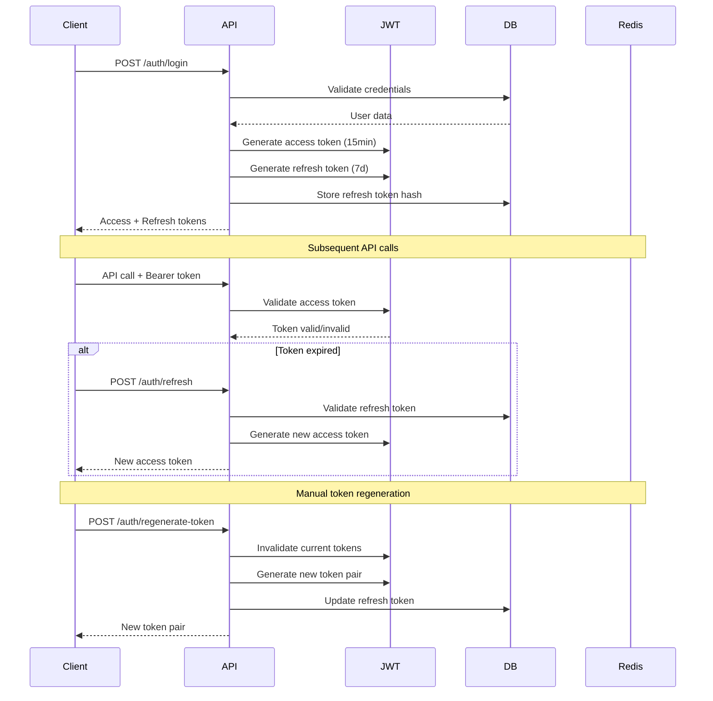
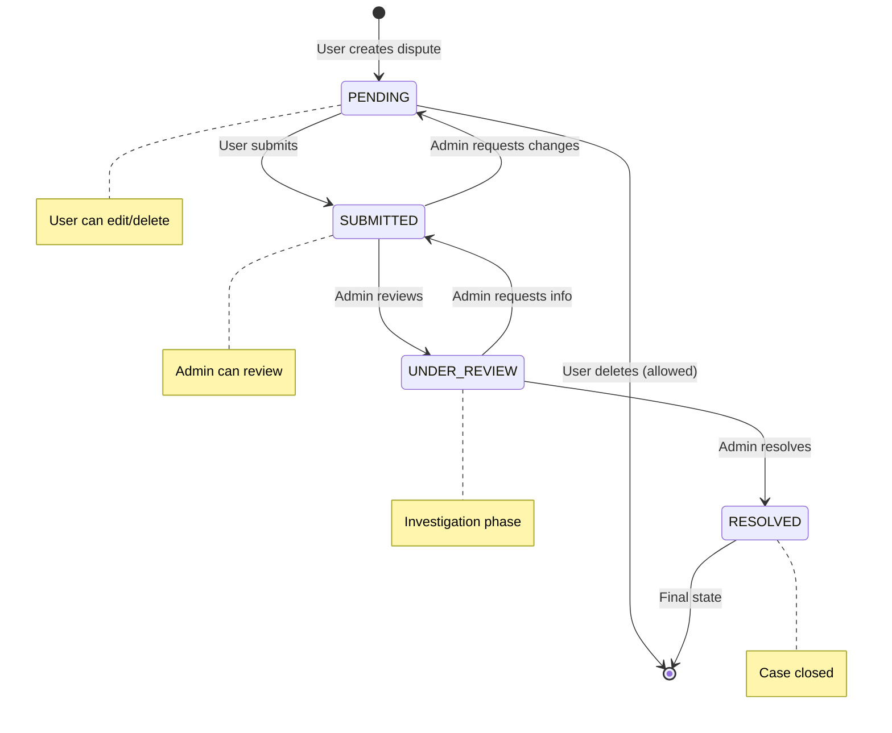
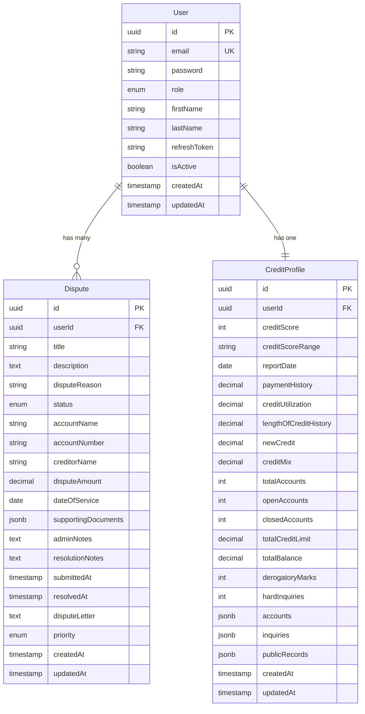

# System Design - Credit Profile & Dispute Management

## 🏗️ Architecture Overview

This system follows a **modular monolith** architecture pattern using NestJS, providing clear separation of concerns while maintaining simplicity for development and deployment.

```
┌─────────────────┐    ┌─────────────────┐    ┌─────────────────┐
│   Frontend      │    │   Load Balancer │    │   Monitoring    │
│   (Next.js)     │◄──►│   (Optional)    │◄──►│   & Logging     │
└─────────────────┘    └─────────────────┘    └─────────────────┘
         │                       │                       │
         ▼                       ▼                       ▼
┌─────────────────────────────────────────────────────────────────┐
│                    NestJS Backend API                           │
├─────────────────┬─────────────────┬─────────────────────────────┤
│   Auth Module   │  Credit Module  │      Disputes Module        │
├─────────────────┼─────────────────┼─────────────────────────────┤
│   JWT Strategy  │  Mock Provider  │      AI Service             │
│   Guards        │  Data Service   │      Status Management      │
│   Decorators    │  Profile Logic  │      Workflow Engine        │
└─────────────────┴─────────────────┴─────────────────────────────┘
         │                       │                       │
         ▼                       ▼                       ▼
┌─────────────────┐    ┌─────────────────┐    ┌─────────────────┐
│   PostgreSQL    │    │     Redis       │    │   OpenAI API    │
│   (Primary DB)  │    │   (Sessions)    │    │   (AI Letters)  │
└─────────────────┘    └─────────────────┘    └─────────────────┘
```

## 🔐 Authentication & Token Handling Flow

### JWT Authentication Architecture



### Token Security Strategy

- **Access Tokens**: Short-lived (15 minutes) for API access
- **Refresh Tokens**: Long-lived (7 days) stored as hashed values
- **Manual Regeneration**: Users can force new token generation
- **Role-based Claims**: JWT includes user role for authorization
- **Secure Storage**: Refresh tokens hashed with bcrypt before database storage

## 💳 Credit Data Mock Strategy

### Third-Party Integration Simulation

```typescript
interface CreditProviderAdapter {
  fetchCreditProfile(userId: string): Promise<CreditProfile>;
  refreshCreditData(userId: string): Promise<CreditProfile>;
}

class MockArrayAPIAdapter implements CreditProviderAdapter {
  async fetchCreditProfile(userId: string): Promise<CreditProfile> {
    // Simulate Array API response with realistic data
    return generateMockCreditProfile(userId);
  }
}
```

### Data Generation Strategy

1. **Realistic Credit Scores**: 300-850 range with weighted distribution
2. **Account Diversity**: Credit cards, loans, mortgages with varying statuses
3. **Payment History**: Visual representation with symbols (● = on time, ○ = late)
4. **Credit Utilization**: Calculated from actual account balances
5. **Inquiries & Public Records**: Time-based realistic scenarios

### Mock Data Architecture

```
Credit Profile Generation:
├── Base Score Calculation (720 ± randomization)
├── Account Generation
│   ├── Credit Cards (2-4 accounts)
│   ├── Installment Loans (0-2 accounts)
│   └── Closed Accounts (1-3 historical)
├── Inquiry Generation (0-5 recent inquiries)
├── Public Records (0-1 records, rare)
└── Score Factors Calculation
    ├── Payment History (35%)
    ├── Credit Utilization (30%)
    ├── Length of History (15%)
    ├── New Credit (10%)
    └── Credit Mix (10%)
```

## 🔄 Dispute Status Handling

### State Machine Implementation



### Status Transition Rules

| From State   | To State     | Allowed By | Conditions             |
| ------------ | ------------ | ---------- | ---------------------- |
| PENDING      | SUBMITTED    | User       | Dispute complete       |
| PENDING      | Deleted      | User/Admin | Any time               |
| SUBMITTED    | UNDER_REVIEW | Admin      | Begin investigation    |
| UNDER_REVIEW | RESOLVED     | Admin      | Investigation complete |
| Any          | RESOLVED     | Admin      | Force resolution       |

### Workflow Engine

```typescript
class DisputeWorkflowEngine {
  async transitionStatus(
    disputeId: string,
    fromStatus: DisputeStatus,
    toStatus: DisputeStatus,
    actor: UserRole,
  ): Promise<void> {
    const transition = this.validateTransition(fromStatus, toStatus, actor);
    await this.executeTransition(disputeId, transition);
    await this.notifyStakeholders(disputeId, transition);
  }
}
```

## 🤖 AI Integration Architecture

### OpenAI Integration with Fallback

```typescript
class AIService {
  async generateDisputeLetter(request: GenerateLetterDto): Promise<string> {
    try {
      if (this.openaiConfigured) {
        return await this.generateWithOpenAI(request);
      }
    } catch (error) {
      this.logger.warn('OpenAI failed, using fallback');
    }

    return this.generateMockLetter(request);
  }
}
```

### Template-Based Fallback System

```
AI Letter Generation:
├── OpenAI Integration (Primary)
│   ├── GPT-3.5-turbo model
│   ├── Professional prompts
│   └── Error handling
└── Mock Template System (Fallback)
    ├── Identity Theft Template
    ├── Inaccurate Info Template
    ├── Paid Off Template
    ├── Duplicate Entry Template
    └── Generic Dispute Template
```

### Prompt Engineering Strategy

```typescript
const SYSTEM_PROMPT = `
You are a professional credit dispute letter writer. Generate formal, 
legally sound dispute letters based on provided information. Include:
1. Proper business letter format
2. Clear dispute reason statement
3. Request for investigation
4. Legal references (FCRA)
5. Professional tone
`;

const buildUserPrompt = (dto: GenerateLetterDto) => `
Generate dispute letter for: ${dto.disputeReason}
Account: ${dto.accountName}
Details: ${dto.additionalDetails}
Tone: ${dto.tone}
`;
```

## 💾 Database Design

### Entity Relationship Diagram



### Database Optimization Strategy

1. **Indexing Strategy**:
   - Primary keys (automatic)
   - Foreign keys for joins
   - Email for login queries
   - Dispute status for filtering
   - Created dates for ordering

2. **JSONB Usage**:
   - Credit accounts array for flexible schema
   - Supporting documents for file metadata
   - Inquiries and public records for complex data

3. **Performance Considerations**:
   - Connection pooling via TypeORM
   - Lazy loading for large relations
   - Pagination for list endpoints
   - Database migrations for schema changes

## 🔧 Error Handling & Resilience

### Exception Hierarchy

```
ApplicationException
├── AuthenticationException
│   ├── InvalidCredentialsException
│   ├── TokenExpiredException
│   └── UnauthorizedException
├── BusinessLogicException
│   ├── DisputeStateException
│   ├── CreditProfileException
│   └── ValidationException
└── ExternalServiceException
    ├── AIServiceException
    ├── DatabaseException
    └── RedisException
```

### Circuit Breaker Pattern (AI Service)

```typescript
class AIServiceCircuitBreaker {
  private failureCount = 0;
  private lastFailureTime = 0;
  private state: 'CLOSED' | 'OPEN' | 'HALF_OPEN' = 'CLOSED';

  async execute<T>(operation: () => Promise<T>): Promise<T> {
    if (this.state === 'OPEN') {
      if (this.shouldAttemptReset()) {
        this.state = 'HALF_OPEN';
      } else {
        throw new Error('Circuit breaker is OPEN');
      }
    }

    try {
      const result = await operation();
      this.onSuccess();
      return result;
    } catch (error) {
      this.onFailure();
      throw error;
    }
  }
}
```

## 🚀 Performance & Scalability Considerations

### Caching Strategy

1. **Redis Caching**:
   - Session storage
   - JWT blacklist for logout
   - Credit profile caching (30 minutes)
   - AI letter templates

2. **Database Optimization**:
   - Connection pooling
   - Read replicas (future)
   - Query optimization with indexes
   - Pagination for large datasets

### Monitoring & Observability

```typescript
// Custom metrics
@Injectable()
class MetricsService {
  private readonly disputeCreationCounter = new Counter(
    'disputes_created_total',
  );
  private readonly aiRequestDuration = new Histogram(
    'ai_request_duration_seconds',
  );
  private readonly creditProfileRequests = new Counter(
    'credit_profile_requests_total',
  );
}
```

## 🔒 Security Architecture

### Defense in Depth Strategy

1. **Input Validation**: Class-validator on all DTOs
2. **Authentication**: JWT with short expiry
3. **Authorization**: Role-based access control
4. **Data Protection**: Password hashing, sensitive data masking
5. **API Security**: Rate limiting, CORS configuration
6. **Database Security**: Parameterized queries, connection encryption

### Security Headers & Middleware

```typescript
app.use(helmet()); // Security headers
app.use(rateLimit({ windowMs: 15 * 60 * 1000, max: 100 })); // Rate limiting
app.enableCors({ origin: process.env.ALLOWED_ORIGINS }); // CORS
```

This system design provides a robust, scalable foundation for credit management with clear separation of concerns, comprehensive error handling, and security-first approach.
